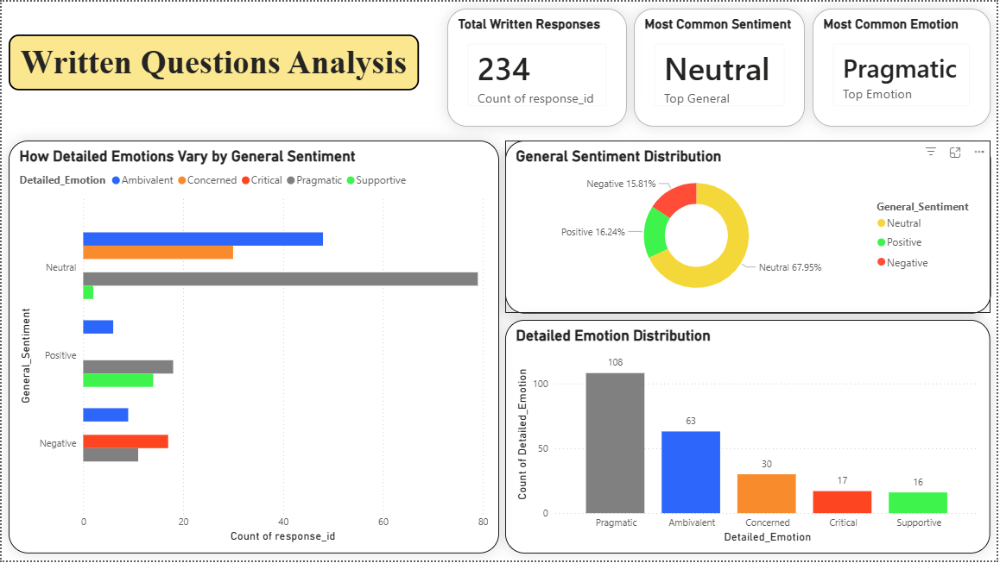
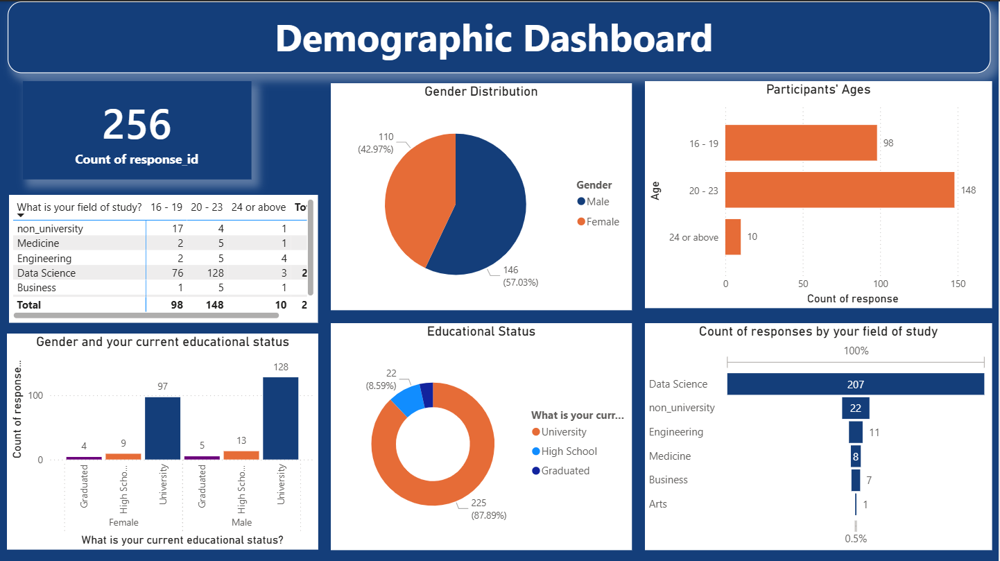
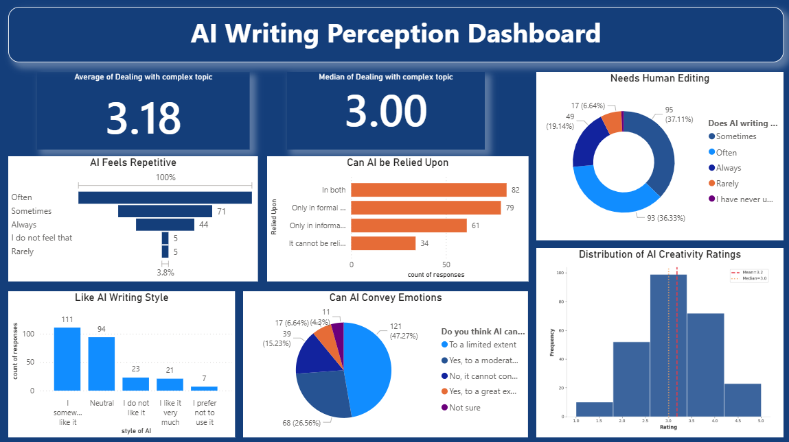
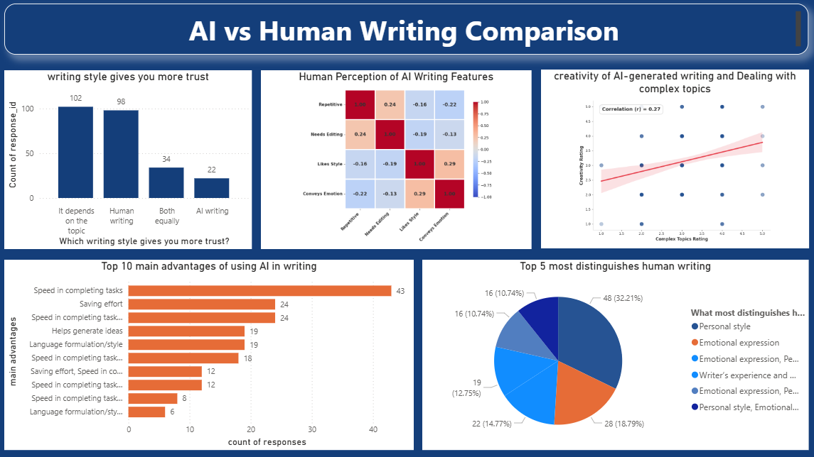
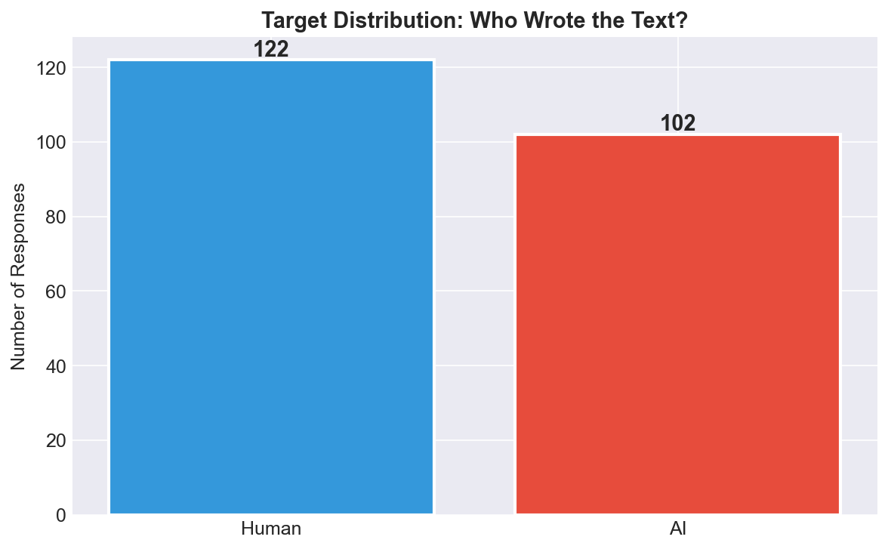
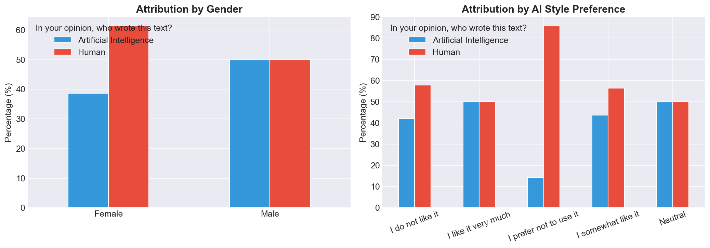
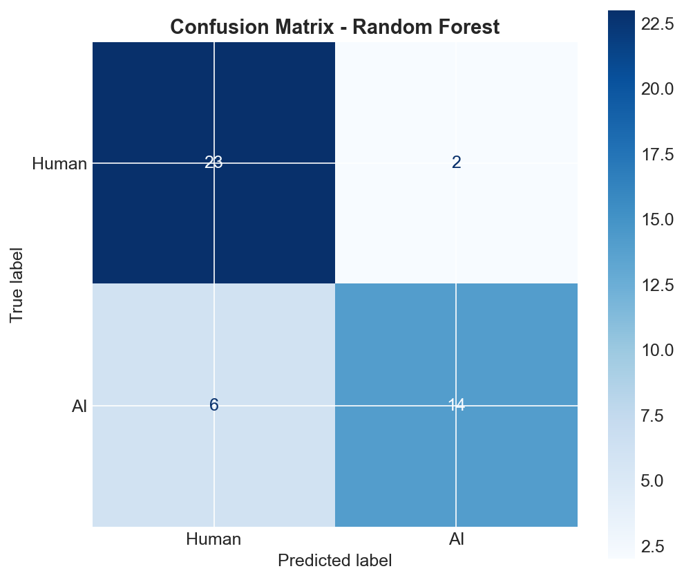
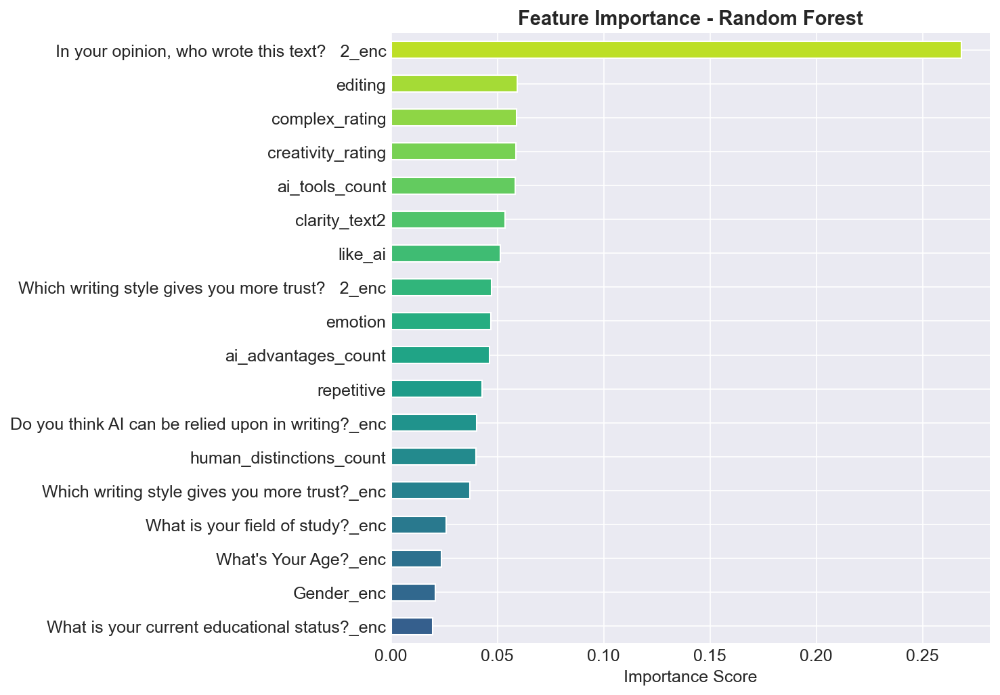
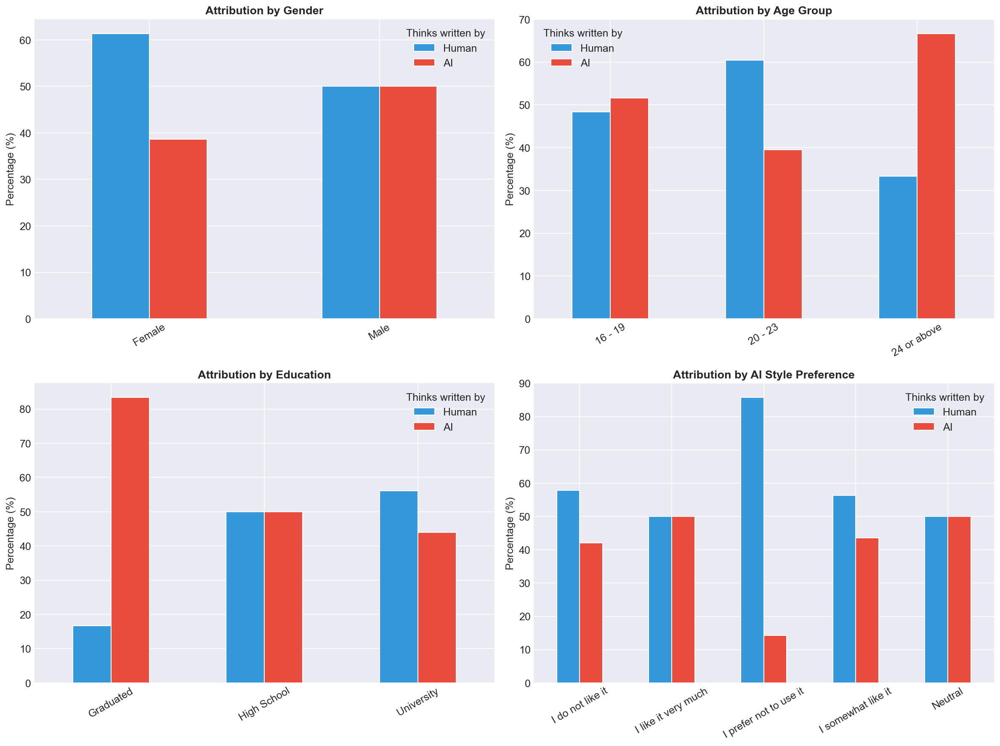

# 🤖 AI Writing vs Human Writing — Survey Analytics

<div align="center">



### *Bridging the gap between human perception and AI-generated content through data-driven analysis*

[](https://python.org)
[](https://powerbi.microsoft.com)
[](https://scikit-learn.org)
[]()

</div>

---

## 📌 Overview

This project investigates how humans perceive and distinguish between **AI-generated** and **human-written** text. Using a structured survey with **256 participants**, we built a complete analytics pipeline — from raw data collection to predictive machine learning — to uncover patterns in human judgment.

> **Key Result:** Our best model achieves **82.2% accuracy** in predicting whether a participant will label a text as *Human* or *AI*.

---

## ✨ What This Project Does

| Phase | Tool | Description |
|-------|------|-------------|
| 📊 **Descriptive Analytics** | Power BI | Interactive dashboards exploring demographics, opinions, and writing preferences |
| 🧪 **Inferential Analytics** | Python (scipy) | Statistical hypothesis testing (Chi-Square, Kruskal-Wallis, Logistic Regression) |
| 🤖 **Predictive Modeling** | Scikit-Learn | Binary classification: *Who wrote this text — AI or Human?* |
| 📝 **Sentiment Analysis** | Python (NLP) | Classifying open-ended written responses into Positive / Neutral / Negative |

---

## 📸 Visualization Gallery

### 🏠 Power BI Dashboards

<div align="center">
  <table>
    <tr>
      <td align="center">
        
        <br><b>Demographic Dashboard</b><br>
        <i>Age, gender & field of study distribution</i>
      </td>
      <td align="center">
        
        <br><b>AI Writing Perception</b><br>
        <i>How participants rate and feel about AI writing</i>
      </td>
    </tr>
    <tr>
      <td align="center">
        
        <br><b>AI vs Human Comparison</b><br>
        <i>Side-by-side perception analysis of both writing styles</i>
      </td>
      <td align="center">
        
        <br><b>Written Questions Analysis</b><br>
        <i>Sentiment analysis of open-ended written responses</i>
      </td>
    </tr>
  </table>
</div>

### 🧠 Machine Learning Results

<div align="center">
  <table>
    <tr>
      <td align="center">
        
        <br><b>Target Distribution</b><br>
        <i>Balanced dataset: 122 Human vs 102 AI labels</i>
      </td>
      <td align="center">
        
        <br><b>Exploratory Analysis</b><br>
        <i>Attribution patterns by gender & AI preference</i>
      </td>
    </tr>
    <tr>
      <td align="center">
        
        <br><b>Model Evaluation (82% Accuracy)</b><br>
        <i>Confusion matrix — 37 correct out of 45 test samples</i>
      </td>
      <td align="center">
        
        <br><b>Feature Importance</b><br>
        <i>Top predictors: text clarity, complexity rating, AI tool usage</i>
      </td>
    </tr>
  </table>
</div>

<div align="center">
  
  <br><b>Attribution by Demographics</b>
  <br><i>How different demographic groups distribute their Human vs AI judgments</i>
</div>

---

## 📂 Project Structure

```
Ai-Writing-vs-Human-Writing-Survey-Analytics/
│
├── 📁 data/
│   ├── Written Questions.xlsx               # Raw survey responses
│   ├── Written Questions_classified.xlsx    # Sentiment-classified responses
│   └── cleaned_data.xlsx                   # Processed MCQ data (256 × 21)
│
├── 📁 media/                               # All charts and dashboard images
│
├── 📁 documentation/
│   ├── Full_Documentation.html             # 📄 Comprehensive A4 documentation
│   ├── Summary_Report.html                 # 📋 Executive summary report
│   └── [Phase PDFs...]                     # Phase-by-phase legacy docs
│
├── 📓 Attribution_Model.ipynb              # ML model: predicts AI vs Human
├── 📓 Inferential.ipynb                    # Statistical hypothesis testing
├── 🐍 classify_sentiment.py               # Sentiment classification script
└── 📈 MCQ & Written Questions Analysis.pbix # Merged Power BI dashboard
```

---

## 🚀 Quick Start

1. **Explore the Data** — Open `data/cleaned_data.xlsx` to see the raw survey structure
2. **Run the Model** — Open `Attribution_Model.ipynb` and run all cells (requires Python + scikit-learn)
3. **View Dashboards** — Open `MCQ & Written Questions Analysis.pbix` in Power BI Desktop
4. **Read the Docs** — Open `documentation/Full_Documentation.html` in any browser → Print as PDF

---

## 📊 Key Results at a Glance

```
Dataset:     256 survey participants × 21 questions
Model:       Random Forest Classifier
Accuracy:    82.2% (37/45 correct on test set)
Best Feature: Text clarity rating (Text 2)
```

---

## 🛠️ Tech Stack

`Python` · `pandas` · `scikit-learn` · `matplotlib` · `seaborn` · `scipy` · `statsmodels` · `Power BI`

---

<div align="center">

**Built with passion for Data Science & Human-AI Interaction Research** ❤️

**Author:** Mustafa Younis · April 2026

</div>
